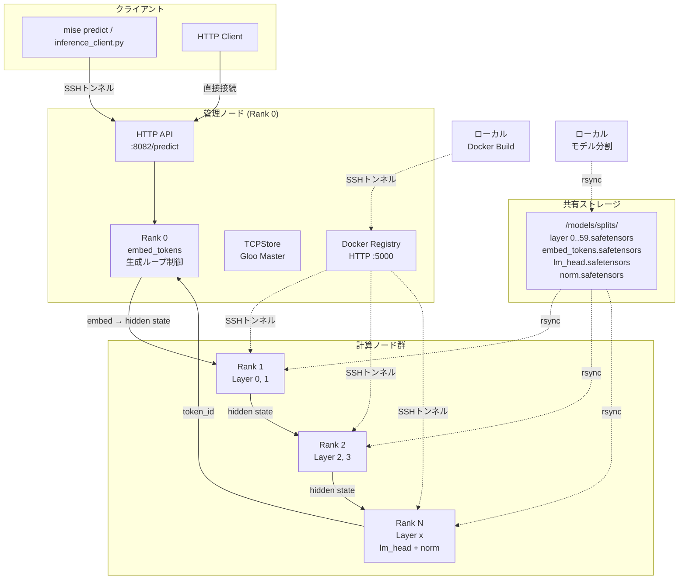
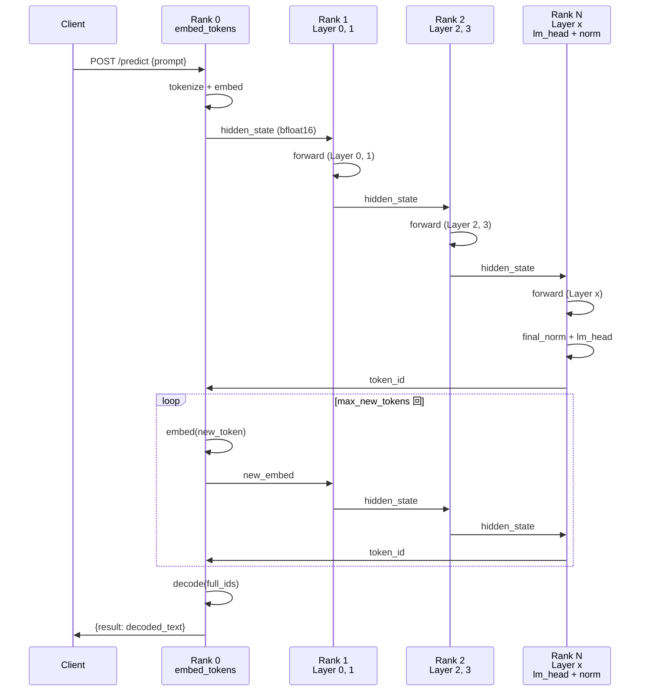
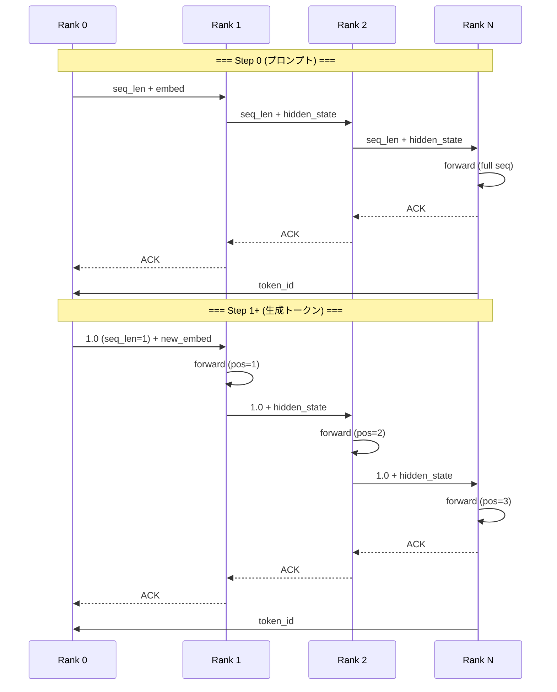
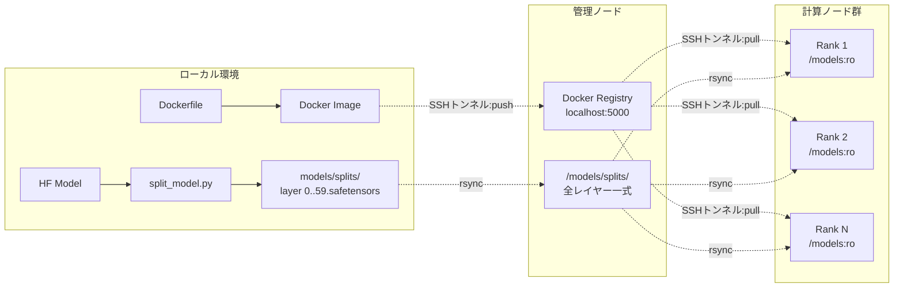
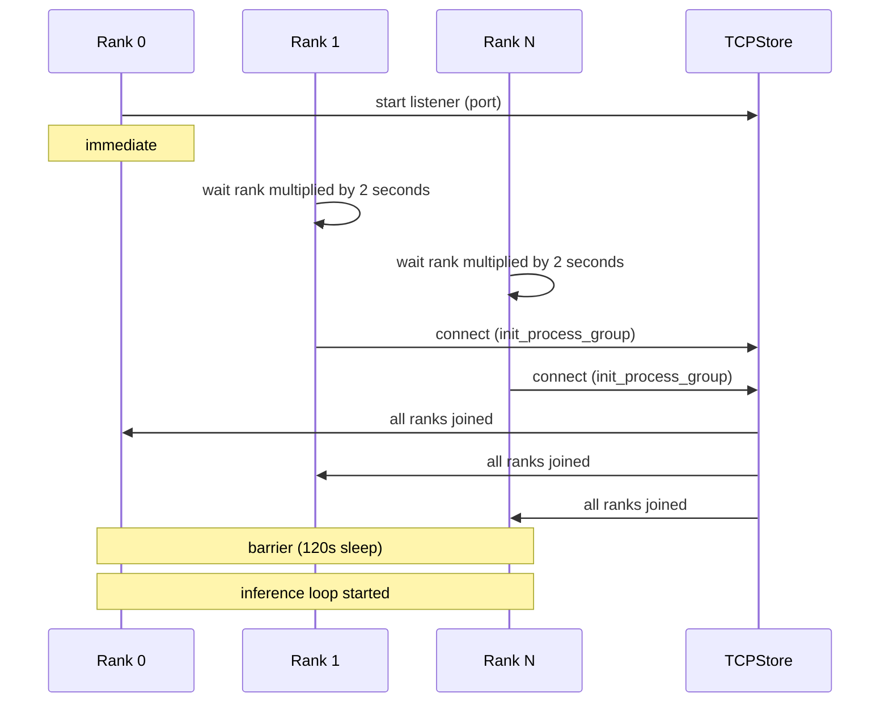

# 超多段CPUパイプライン並列 LLM 分散推論システム

`distributed-llm` は，単一CPUのメモリ容量や計算力では扱えない規模の言語モデル (Gemma-4 31B-it 等) を，ネットワークで接続された数十台のCPUマシンにまたがって推論実行するシステムである．PyTorch の Gloo バックエンドを用いたパイプライン並列 (Pipeline Parallelism) により，モデルのトランスフォーマーレイヤーを複数のノードに分割し，各ノードが順次データを中継するストリーミング処理によってオート回帰生成を実現する．

本システムは以下の 4 層で構成される．

1. **パイプライン推論エンジン** — ノード上で動作する単一の Python スクリプト (`pipeline_inference.py`) 
2. **モデル分割・配布ツール** — Hugging Face からのモデル取得からノード間配布までを自動化するスクリプト群
3. **デプロイメントオーケストレーション** — Docker イメージのビルド・レジストリ経由の配布・コンテナ起動を管理するスクリプト
4. **運用・監視ツール** — ヘルスチェック，ログ閲覧，デバッグ，クラスタ制御のためのユーティリティ

## 目次

- [アーキテクチャ](#アーキテクチャ)
- [技術スタック](#技術スタック)
- [システム構成](#システム構成)
- [パイプライン並列の理論](#パイプライン並列の理論)
- [パイプライン並列の仕組み](#パイプライン並列の仕組み)
- [推論プロトコル](#推論プロトコル)
- [最適化技術](#最適化技術)
- [ディレクトリ構成](#ディレクトリ構成)
- [セットアップ](#セットアップ)
- [デプロイメント](#デプロイメント)
- [推論の実行](#推論の実行)
- [運用・監視](#運用監視)
- [設定ファイル](#設定ファイル)
- [技術的詳細](#技術的詳細)
- [運用上の制約](#運用上の制約)

---

## アーキテクチャ

本システムは「管理ノード (マスター) 」と「計算ノード (ワーカー) 」からなるクラスタ上で動作する．管理ノードは Docker プライベートレジストリの構築，SSH 経由のデプロイ命令の配布，ヘルスチェックの集約を担当する．計算ノードは実際にモデルのレイヤーを保持し，パイプライン通信による推論処理を行う．

各ノードは `docker run` で起動したコンテナ内で `pipeline_inference.py` を実行する．コンテナ間は `--net=host` モードで接続され，Gloo バックエンドの TCP ソケット通信によって hidden state の送受信を行う．モデル重みはホスト上の `/models` ディレクトリにマウントされ，全ノードで読み取り専用として共有される．



## 技術スタック

| 層         | 技術                        | 役割                                       |
| ---------- | --------------------------- | ------------------------------------------ |
| 実行環境   | Python 3.12 + PyTorch (CPU) | テンソル演算                               |
| 分散通信   | PyTorch Gloo (TCP)          | プロセス間通信，プロセスグループ管理       |
| モデル形式 | safetensors                 | メモリマップ対応の高速ウェイトフォーマット |
| コンテナ   | Docker (host network)       | ノード単位の環境隔離                       |
| 配信       | SSH + rsync                 | モデル重み・設定ファイルの配布             |
| レジストリ | Docker Registry v2 (HTTP)   | Docker イメージのプライベート保管          |
| タスク管理 | mise.toml                   | ビルド・デプロイ・運用コマンドの定義       |

## システム構成

デプロイ時の典型構成は以下の通りである．

```
wafl-ctrl1  (マスター / TCPStore / Docker Registry / HTTP API)
  |
  +-- wafl100 ~ wafl139  (Rank 1 ~ 40)
  |
  +-- wafl200 ~ wafl209  (Rank 41 ~ 50)
```

- **マスター (Rank 0):** TCPStore のオーナー．埋め込み (`embed_tokens`) の読み込み，HTTP リクエストの受理，生成ループの制御を担当するが，トランスフォーマーレイヤーは保持しない．
- **ワーカー (Rank 1+):** 1つ以上のトランスフォーマーレイヤーを保持し，前ノードから hidden state を受信して計算後，次ノードへ送信する．最終ランク (Rank N) は `lm_head` と `final_norm` を持ち，トークン ID を生成してマスターへ返却する．

## パイプライン並列の理論

### パイプライン並列 (Pipeline Parallelism) とは

モデル並列 (Model Parallelism) の一分野であり，ディープラーニングモデルのレイヤーを複数のデバイス (ここでは CPU ノード) に分割し，データをパイプライン状に流して並列計算を行う手法である．順伝播 (forward pass) では，各ノードが入力データを受け取って自身のレイヤーを計算し，出力を次ノードへ渡す．逆伝播 (backward pass) ではその逆順で勾配が流れる．

本システムはオート回帰生成 (autoregressive generation) を対象としているため，各ステップで 1 トークンずつ生成し，そのたびに全レイヤーを順次通過させる．このため，パイプラインの各ノードは「計算 → 通信 → 計算 → 通信」のサイクルを繰り返す．

### 計算量と通信量の分析

Gemma-4 31B-it の単一レイヤー (decoder layer) の計算量は，隠れ層サイズ $d_{\text{model}} = 5376$，注意ヘッド数 $h = 32$，KV ヘッド数 $h_{\text{kv}} = 16$，シーケンス長 $n$ としたとき，おおむね以下の通りである．

- **Self-attention:** $O(n \cdot d_{\text{model}}^2 / h \cdot h_{\text{kv}})$
- **MLP (GELU):** $O(4 \cdot n \cdot d_{\text{model}}^2 / \text{ffn\_mult})$
- **RMSNorm:** $O(n \cdot d_{\text{model}})$

通信量は，hidden state の形状が $(b, n, d_{\text{model}})$，dtype が `bfloat16` (2 バイト) のため，1回の送受信で $2 \cdot b \cdot n \cdot d_{\text{model}}$ バイトとなる．$b=1$，$n=1$ (生成ステップ) ，$d_{\text{model}}=5376$ のとき，約 10.5 KB／ノード間．

### パイプラインバブル

パイプライン並列における主要な非効率要因は「パイプラインバブル」である．バッチサイズ $B$，パイプラインステージ数 $D$ のとき，初期ウォームアップと最終アイドルを含むバブルのステップ数は $2(D-1)$ となる．マイクロバッチ数 $M$ で分割した場合，バブル割合は以下の式で表される．

$$
\text{バブル割合} = \frac{D - 1}{M + D - 1}
$$

本システムでは $M=4$，$D=51$ (51ノード) の場合，バブル割合は約 92.4% となる．ただし，これはバッチ単位の見通しであり，マイクロバッチを隙間なく流すことで実効バブルはより小さくなる．また，リレーモード (オンデマンド生成) ではバッチ処理ではないため，この式は参考値となる．

### 非対称レイヤー割り当ての動機

単純な均等割り当て (各ノード $L/W$ レイヤー) では，パイプラインの後段 (最終ランクに近いノード) に負荷が集中する傾向がある．なぜなら，最終ランクは `lm_head` と `final_norm` の追加計算に加え，トークン ID の生成 (argmax) と逆チェーンでの hidden state 返却の責務も持つためである．

本システムは，各ノードが少なくとも 1 レイヤーを持つことを保証した上で，余ったレイヤーを先頭ノードから順に追加で割り当てる．これにより，パイプラインの後段の負荷増加を，先頭ノードの余剰レイヤー吸収で相殺する．

## パイプライン並列の仕組み

### 非対称レイヤー割り当て

総レイヤー数を $L$，ノード数を $W$ としたとき，以下のように割り当てる．

```
layers_high = L - W + 2

Rank 0            : []              (TCPStore のみ)
Rank < layers_high: 2 レイヤーずつ  (例: Rank 1 -> [0, 1], Rank 2 -> [2, 3])
Rank >= layers_high: 1 レイヤーずつ  (各ノード最大 2 レイヤー)
```

このスキームにより，Rank 1 がレイヤー 0 と 1 を担当し，Rank 2 がレイヤー 2 と 3 を担当する．残りレイヤー数がノード数を超える場合は，先頭のノードから順に 2 レイヤーずつ割り当てられる．

### 各ランクの責務



- **Rank 0:** プロンプトのトークン化，埋め込み生成，`embed_tokens` 重みの保持．HTTP POST `/predict` を受理．
- **中間ランク:** 前ノードから hidden state を受信，担当レイヤーで forward 計算，次ノードへ送信．
- **最終ランク:** 全レイヤーの forward 計算後，`final_norm` + `lm_head` でロジットを計算し，argmax でトークン ID を取得．マスターへ返却．

## 推論プロトコル

推論は 2 つのモードで動作する．

### リレーモード (オンデマンド生成) 

1. クライアントが HTTP POST でプロンプトを Rank 0 に送信
2. Rank 0 が全ノードにシグナルをブロードキャスト (ソケットベース) 
3. 各ノードが `_relay_request` を実行：
   - **Phase 1 (順チェーン) :** Rank 0 -> Rank 1 -> ... -> Rank N
     - Rank 0: embed を Rank 1 に送信
     - 中間ランク: 受信 -> 計算 -> 次ノードへ送信
     - 最終ランク: 受信 -> 計算 -> `lm_head` でトークン ID を生成
   - **Phase 2 (逆チェーン) :** Rank N -> ... -> Rank 1 -> Rank 0
     - 最終ランク: hidden state を前ノードへ返却
     - 各ランク: 受信 -> 計算 -> 前ノードへ送信
     - Rank 0: hidden state を受信 -> `final_norm` + `lm_head` -> トークン ID
4. 生成トークンがストップトークン (1 or 2) に達するか，同一トークンが 5 回連続するまでステップ 3 を繰り返す

各ステップは ACK チェーンによって同期される．各ランクは次ノードへデータを送信した後，次ノードからの ACK を受信するまで待機する．これにより，通信の完了が保証され，データ競合を防ぐ．



### パイプラインループモード (バックグラウンド) 

リレーモード実行中，パイプラインスレッドはマイクロバッチの空ループを回っており，通信バッファとの競合を避けるために `_relay_active` フラグで制御される．リレーモードが終了すると，パイプラインループが再開される．

## 最適化技術

### ゼロアロケーション通信

推論ループ中に `torch.zeros()` や `tensor.clone()` 等のメモリアロケーションを一切実行せず，事前に確保した `recv_buffers` と `send_buffers` への in-place 受信・コピーのみで通信を行う．これにより，GC ストップやメモリ断片化によるレイテンシ変動を排除する．

各バッファは `(batch_size, seq_len, hidden_size)` 形状で `bfloat16` 型．マイクロバッチ数分 (デフォルト 4) を事前確保する．

### マイクロバッチ分割

1つのバッチを `num_micro_batches` 個に分割してパイプラインに流す．これにより，パイプラインバブル (ノードがアイドルになる時間) を最小化する．

### 時間差起動プロトコル

全ノードが同時に Gloo プロセスグループの初期化を開始すると，thundering herd 問題によって接続タイムアウトが発生する可能性がある．これを回避するため，Rank 0 が即座に listener を開始し，他ランクは `rank * 2` 秒 (最大 60 秒) のウェイトを挿入してから接続する．

また，モデルの時間差読み込み (Staggered Model Loading) により，ノード間でのモデルロード完了時刻の偏りを緩和する．

```mermaid
gantt
    title ノード起動の時間差プロトコル
    dateFormat ss
    axisFormat %Ss
    
    section Rank 0
    TCPListener    :a1, 0, 2s
    Model Load     :a2, after a1, 5s
    Inference Loop :a3, after a2, 5s
    
    section Rank 1
    Wait           :b1, 0, 2s
    PG Init        :b2, after b1, 1s
    Model Load     :b3, after b2, 5s
    Inference Loop :b4, after b3, 5s
    
    section Rank 2
    Wait           :c1, 0, 4s
    PG Init        :c2, after c1, 1s
    Model Load     :c3, after c2, 5s
    Inference Loop :c4, after c3, 5s
    
    section Rank N
    Wait           :d1, 0, 60s
    PG Init        :d2, after d1, 1s
    Model Load     :d3, after d2, 5s
    Inference Loop :d4, after d3, 5s
```



### 物理 NIC 固定バインド

Gloo バックエンドが使用するネットワークインターフェースを環境変数 `GLOO_SOCKET_IFNAME` で明示的に指定する．`ip route` コマンドでデフォルトルートの物理 NIC を動的検出し，それを指定する．これにより，仮想インターフェースやループバック経由での通信誤接続を防ぐ．

### Intel OpenMP 差し替え

GNU OpenMP の代わりに Intel OpenMP ランタイムを `LD_PRELOAD` で差し替える．これにより，`KMP_AFFINITY` による細粒度のスレッドアフィニティ制御 (`granularity=fine,compact,1,0`) を有効化し，CPU コア間でのキャッシュ共有を最適化する．

### KV-cache 対応

各トランスフォーマーレイヤーに KV-cache を実装し，オート回帰生成時に既に処理済みトークンの key/value 表現を再利用する．Gemma-4 の sliding window attention に対応し，スライディングウィンドウ外のキャッシュを自動的に切り捨てる．

各レイヤーごとに独立した書き込み位置カウンター (`_kv_cache_write_pos_ref`) を持ち，全ランクが同じ位置に正しく書き込むことを保証する．

## ディレクトリ構成

```
.
├── pipeline_inference.py   # パイプライン推論ノードのメインエンジン (単一ファイル) 
├── pyproject.toml          # Python プロジェクト定義 (uv + hatch) 
├── mise.toml               # タスク定義 (ビルド・デプロイ・運用コマンド) 
├── Dockerfile              # コンテナイメージ定義
├── config.json             # 環境固有の設定 (モデル，クラスタ，SSH 等) 
├── config.json.example     # 設定テンプレート
├── hosts.txt               # クラスタノード一覧 (各行が Rank 番号に対応) 
├── models/                 # 分割済みモデル重み (gitignore 対象) 
│   └── splits/
│       ├── layer_0.safetensors ~ layer_59.safetensors
│       ├── embed_tokens.safetensors
│       ├── lm_head.safetensors
│       ├── norm.safetensors
│       └── split_info.json  # 各レイヤーのファイル情報・パラメータ数
└── tools/
    ├── common.py            # 全ツールで共有のユーティリティ (SSH, rsync, 設定読み込み) 
    ├── deploy.py            # 自動デプロイスクリプト (ビルド・分割・配布・起動) 
    ├── split_model.py       # Hugging Face モデルのレイヤー分割ツール
    ├── setup_registry.py    # Docker プライベートレジストリの構築
    ├── cluster_control.py   # コンテナの停止・再起動・クリーンアップ
    ├── healthcheck.py       # 全ノードのヘルスチェック
    ├── show_logs.py         # コンテナログの一括表示
    ├── debug_tools.py       # SSH・MTU・ポート・温度等のデバッグ
    ├── predict.py           # 推論リクエスト送信クライアント
    └── inference_client.py  # SSHトンネル経由の推論クライアント
```

## セットアップ

### 前提条件

- Python 3.12 以上
- `uv` (Python パッケージ管理ツール) 
- `mise` (タスクランチャ) 
- Docker (ローカルビルド用) 
- SSH キー認証が設定された管理ノードへのアクセス

### 初期設定

```bash
# 1. 依存関係のインストール
mise run sync

# 2. 設定ファイルの作成
cp config.json.example config.json
# config.json を環境に合わせて編集
```

`config.json` の主要項目は以下の通りである．

- `model.name`: Hugging Face のモデル名 (例: `google/gemma-4-31B-it`) 
- `model.overrides`: モデル仕様のオーバーライド (`num_hidden_layers`, `hidden_size` 等) 
- `cluster.master_addr`: マスターノードのホスト名
- `cluster.master_port`: PyTorch Gloo マスターポート
- `cluster.hosts_file`: ノード一覧ファイル
- `ssh.user`: SSH 接続ユーザー名
- `docker.image_name`: Docker イメージ名
- `deploy.work_dir`: リモートノード上の作業ディレクトリ

### hosts.txt の設定

`hosts.txt` の各行が Rank 番号に対応する．1 行目が Rank 0 (マスター) ，2 行目が Rank 1，... となる．

```
wafl-ctrl1    # Rank 0 (マスター)
wafl100       # Rank 1
wafl101       # Rank 2
...
wafl139       # Rank 40
wafl200       # Rank 41
...
wafl209       # Rank 50
```

## デプロイメント

### Docker レジストリの構築

管理ノード上で Docker プライベートレジストリを起動する．

```bash
mise run setup:registry
```

これにより，マスターノードのポート 5000 に HTTP (TLS なし) の Docker Registry v2 が起動する．

### モデルの分割とダウンロード

ローカルで Hugging Face からモデルをダウンロードし，レイヤーごとに分割する．

```bash
# 分割計画のみ表示
mise run split:models:dry-run

# 実際の実行 (マスターへ転送含む) 
mise run split:models
```

`split_model.py` は以下の処理を行う．

1. `huggingface_hub.snapshot_download` でモデルをローカルキャッシュに取得
2. `AutoModelForCausalLM` でモデルを CPU にロード
3. `state_dict()` から各レイヤーの重みを抽出
4. `safetensors` 形式で `layer_N.safetensors` として出力
5. `embed_tokens.safetensors`, `lm_head.safetensors`, `norm.safetensors` も個別に出力
6. `split_info.json` に各レイヤーのファイル名，パラメータ数，キー一覧を記録

### 一括デプロイ

全てのフェーズ (ビルド，モデル分割，配布，コンテナ起動) を一度に実行する．

```bash
# ドライラン (実行しない) 
mise run deploy:dry-run

# 実際の実行
mise run deploy
```

各フェーズの詳細は以下の通りである．

| フェーズ    | コマンド                  | 内容                                                                                   |
| ----------- | ------------------------- | -------------------------------------------------------------------------------------- |
| 1. ビルド   | `deploy.py --build-only`  | ローカルで Docker イメージをビルドし，SSH トンネル経由でマスターのレジストリにプッシュ |
| 2. 分割     | `deploy.py --split-only`  | モデルを分割し，マスターへ rsync で転送                                                |
| 3. 配布     | `deploy.py --deploy-only` | マスター上のモデル重みを各ノードに rsync で配布 (最大 10 並列)                         |
| 4. デプロイ | `deploy.py`               | 各ノードにイメージをプルし，コンテナを起動 (時間差で輻輳回避)                          |



### コンテナ起動時の環境変数

各ノードのコンテナには以下の環境変数が設定される．

| 変数                     | 値                           | 説明                                     |
| ------------------------ | ---------------------------- | ---------------------------------------- |
| `MASTER_ADDR`            | マスターノード名             | Gloo マスターのアドレス                  |
| `MASTER_PORT`            | ポート番号                   | Gloo マスターのポート (デフォルト 10000) |
| `RANK`                   | 0 ~ N                        | 自身のノード識別子                       |
| `WORLD_SIZE`             | ノード数                     | クラスタの総ノード数                     |
| `GLOO_SOCKET_IFNAME`     | 検出された NIC               | Gloo の通信インターフェース              |
| `GLOO_SOCKET_TIMEOUT_MS` | 600000                       | Gloo 通信タイムアウト (ms)               |
| `OMP_NUM_THREADS`        | 1                            | OpenMP スレッド数                        |
| `KMP_AFFINITY`           | granularity=fine,compact,1,0 | Intel OpenMP スレッドアフィニティ        |
| `NUM_MICRO_BATCHES`      | 4                            | マイクロバッチ数                         |

## 推論の実行

### HTTP API 経由

マスターノードのポート 8082 で HTTP サーバーが稼働している．POST `/predict` でプロンプトを送信し，JSON 形式で結果を取得する．

```bash
# mise コマンドで送信
mise run predict

# デモ用プロンプト
mise run predict:demo
```

### クライアントスクリプト経由

SSH トンネルを自動的に確立して推論リクエストを送信する．

```bash
uv run python tools/inference_client.py "こんにちは、世界"
```

### レスポンス形式

成功時:

```json
{"result": "生成されたテキスト"}
```

エラー時:

```json
{"error": "process group not ready"}  # 503: 初期化前
{"error": "barrier not completed"}    # 503: バリア未完了
{"error": "only rank 0 handles requests"}  # 500: Rank 0 以外
{"error": "request failed"}           # 500: 推論失敗
{"error": "invalid json"}             # 400: 不正なリクエスト
{"error": "empty prompt"}             # 400: 空のプロンプト
{"error": "not found"}                # 404: 不正なパス
```

## 運用・監視

### ヘルスチェック

全ノードの SSH 接続性，Docker 状態，コンテナ状態，モデル重み，MTU を検証する．

```bash
# 基本チェック
mise run status

# 詳細チェック (CPU 温度，ログ含む) 
mise run status:verbose
```

チェック項目:

1. SSH 接続性 (管理ノード経由) 
2. Docker デーモンの稼働
3. `distributed-llm` コンテナのステータス
4. モデル重みの存在確認
5. MTU 設定 (1500 または 9000 を推奨) 
6. CPU 温度 (verbose 時，85°C 以上を警告) 

### ログ表示

```bash
# 全ノードの最新ログを一括表示
mise run logs

# 特定ノードのログをフォロー表示
RANK=0 uv run python tools/show_logs.py
```

### クラスタ制御

```bash
# 全ノードのコンテナを停止
uv run python tools/cluster_control.py stop

# 全ノードのコンテナを再起動
uv run python tools/cluster_control.py restart

# 全ノードのコンテナとイメージを削除
uv run python tools/cluster_control.py clean
```

### デバッグ

```bash
# SSH 接続テスト
uv run python tools/debug_tools.py ssh

# MTU 設定確認
uv run python tools/debug_tools.py mtu

# モデル重み配置状態確認
uv run python tools/debug_tools.py models

# ポート開放状態確認
uv run python tools/debug_tools.py ports

# CPU 温度確認
uv run python tools/debug_tools.py temp
```

## 設定ファイル

### config.json

```json
{
  "model": {
    "name": "google/gemma-4-31B-it",
    "format": "safetensors",
    "overrides": {
      "num_hidden_layers": 60,
      "hidden_size": 5376,
      "num_attention_heads": 32,
      "num_key_value_heads": 16
    },
    "gemma2": {
      "query_pre_attn_scalar": 256,
      "attn_logit_softcapping": 50.0,
      "final_logit_softcapping": 30.0
    }
  },
  "cluster": {
    "master_addr": "wafl-ctrl1",
    "master_port": 10000,
    "hosts_file": "hosts.txt"
  },
  "ssh": {
    "user": "denjo"
  },
  "docker": {
    "image_name": "distributed-llm:latest"
  },
  "deploy": {
    "work_dir": "/home/denjo/workspace/ktakahashi/distributed-llm"
  }
}
```

各セクションの詳細:

- **model**: モデル仕様．`name` は Hugging Face のリポジトリ名．`format` は重みのファイル形式 (`safetensors` または `pt`) ．`overrides` で `num_hidden_layers` 等を上書き可能．`gemma2` セクションは Gemma-4 固有のハイパーパラメータ．
- **cluster**: クラスタ設定．`master_addr` は TCPStore のオーナーノード．`master_port` は Gloo の初期化ポート．
- **ssh**: SSH 接続情報．
- **docker**: Docker イメージ名．
- **deploy**: リモートノード上の作業ディレクトリ．モデル重みのマウント先となる．

### 環境変数による上書き

`config.json` の設定は以下の環境変数で上書き可能である．環境変数が優先される．

| 環境変数             | 対応設定                            |
| -------------------- | ----------------------------------- |
| `MASTER_ADDR`        | `cluster.master_addr`               |
| `MASTER_PORT`        | `cluster.master_port`               |
| `RANK`               | 自身のランク                        |
| `WORLD_SIZE`         | ノード数                            |
| `GLOO_SOCKET_IFNAME` | 通信インターフェース                |
| `MODEL_NAME`         | `model.name`                        |
| `TOTAL_LAYERS`       | `model.overrides.num_hidden_layers` |
| `WEIGHT_FORMAT`      | `model.format`                      |
| `NUM_MICRO_BATCHES`  | マイクロバッチ数                    |
| `BATCH_SIZE`         | バッチサイズ                        |
| `SEQ_LEN`            | シーケンス長                        |
| `MODEL_PATH`         | モデル重みのパス                    |
| `IMAGE_NAME`         | Docker イメージ名                   |
| `WORK_DIR`           | 作業ディレクトリ                    |

## 技術的詳細

### トランスフォーマーレイヤーの実装

`pipeline_inference.py` 内の `_build_transformer_layer` メソッドは，Gemma-4 のデコーダーレイヤーをミニマルに実装している．各レイヤーの forward 処理は以下の順序で実行される．

1. **Pre-attention RMSNorm** — `input_layernorm.weight`
2. **Self-attention (linear projections)** — `q_proj`, `k_proj`, `v_proj`
3. **Reshape for attention** — マルチヘッド形式に変換
4. **Q/K Norm** — `q_norm.weight`, `k_norm.weight`
5. **RoPE (Rotary Position Embedding)** — `rope_parameters` に従って位置埋め込みを適用
6. **KV-cache 追加** — 新規 KV をキャッシュに追加 (sliding window 対応) 
7. **GQA (Grouped Query Attention)** — KV ヘッドを Q ヘッド数に拡張
8. **Attention scores + causal mask** — スコア計算，因果マスク適用
9. **Output projection** — `o_proj.weight`
10. **Post-attention RMSNorm + residual** — `post_attention_layernorm.weight`
11. **Pre-FFN RMSNorm** — `pre_feedforward_layernorm.weight`
12. **MLP (GELU)** — `gate_proj`, `up_proj`, `down_proj`
13. **Post-FFN RMSNorm + residual** — `post_feedforward_layernorm.weight`
14. **Layer scalar** — `layer_scalar` (0.1 未満の場合は 1.0 に補正) 
15. **NaN/Inf クランプ** — 数値不安定時のガード

```mermaid
graph LR
    A[hidden_state<br/>bfloat16] --> B[Pre-attn<br/>RMSNorm]
    B --> C[Q/K/V Projections]
    C --> D[Reshape +<br/>Q/K Norm]
    D --> E[RoPE]
    E --> F[KV-cache<br/>Append]
    F --> G[GQA<br/>Expand]
    G --> H[Attention<br/>Scores + Mask]
    H --> I[Output Proj]
    I --> J[Post-attn<br/>RMSNorm + Residual]
    J --> K[Pre-FFN<br/>RMSNorm]
    K --> L[MLP<br/>GELU]
    L --> M[Post-FFN<br/>RMSNorm + Residual]
    M --> N[Layer Scalar]
    N --> O[NaN/Inf<br/>Clamp]
    O --> P[output<br/>hidden_state]
```



### RoPE (Rotary Position Embedding)

Gemma-4 は `partial_rotary_factor` (デフォルト 0.25) を採用している．これは，次元の 25% のみを回転させ，残りをそのまま通過させる仕組みである．`rope_type` が `proportional` の場合，スケール係数によってシーケンス長の拡張に対応する．

Rotary Position Embedding は，位置情報を入力ベクトルに直接組み込む位置埋め込み手法である．各次元対 $(2i, 2i+1)$ に対して，位置 $m$ で回転行列を適用する．

$$
x_m = R_\theta(m) \cdot x
$$

ここで $R_\theta(m)$ は周波数ベクトル $\theta$ に基づく回転行列であり，これにより相対位置情報 $m-k$ がモデルに明示的に伝達される．

### Gemma-4 固有の処理

- **query_pre_attn_scalar**: attention スコアの計算時に `head_dim^-0.5` の代わりにこの値を使用
- **final_logit_softcapping**: `lm_head` の出力に `tanh(x / softcap) * softcap` を適用 (デフォルト 30.0) 
- **layer_types**: レイヤーごとに `sliding_attention` または `full_attention` を指定．スライディングウィンドウ attention はウィンドウサイズ 1024 で因果マスクを適用

### 分散通信の詳細

#### プロセスグループ初期化

`dist.init_process_group()` で Gloo バックエンドの初期化を行う．`init_method` として `tcp://{MASTER_ADDR}:{MASTER_PORT}` を指定し，TCPStore 経由のレネズブスを使用する．タイムアウトはデフォルト 600 秒 (`GLOO_SOCKET_TIMEOUT_MS`) ．

リトライ機構があり，最大 5 回の再試行を行う．特に「initialize twice」エラーが発生した場合は，プロセスグループを破棄してから再初期化する．



#### hidden state の通信

通信バッファは `bfloat16` 型で，形状 `(batch_size, seq_len, hidden_size)`．Rank 0 以外は `dist.recv()` で前ノードから受信し，担当レイヤーで forward 計算後，`dist.send()` で次ノードへ送信する．

リレーモードでは，初期ステップでシーケンス長を別チャンネルで送信し，以降のステップではシーケンス長 1 を送信する．最終ランクは非同期 recv (`dist.irecv()`) により，シーケンス長と hidden state の受信を並行化する．

### Docker イメージ

`Dockerfile` は `python:3.12-slim` を基本イメージとし，以下のコンポーネントをインストールする．

- **OpenBLAS**: 高速行列演算ライブラリ
- **numactl**: NUMA メモリアフィニティ制御
- **iproute2**: 物理 NIC の動的検出
- **Intel OpenMP**: GNU OpenMP 差し替え用
- **PyTorch (CPU)**: CPU 専用ホイール
- **transformers, safetensors, huggingface_hub**: モデル読み込み用
- **tqdm**: 進捗表示

Hugging Face のモデル設定はビルド時にプリキャッシュされ，起動時のネットワークハングを防止する．

## 運用上の制約

- **WORLD_SIZE <= num_hidden_layers**: ノード数はレイヤー数を超えられない
- **最大 2 レイヤー/ノード**: `WORLD_SIZE` が小さすぎると，1 ノードが 3 以上のレイヤーを持つことになり，この制限に違反する
- **マスターノード (Rank 0) はレイヤーを保持しない**: TCPStore のみ担当するため，計算負荷は Rank 1+ で分散される
- **生成トークン数**: 最大 32 トークン (`max_new_tokens`) ．同一トークンが 5 回連続したら早期終了
- **KV-cache 容量**: 最大 2048 トークン (プロンプト + 生成の合計) 
- **通信タイムアウト**: デフォルト 10 分 (`GLOO_SOCKET_TIMEOUT_MS=600000`) 
- **初期化タイムアウト**: デフォルト 25 分 (`INIT_TIMEOUT_MINUTES=25`) 
