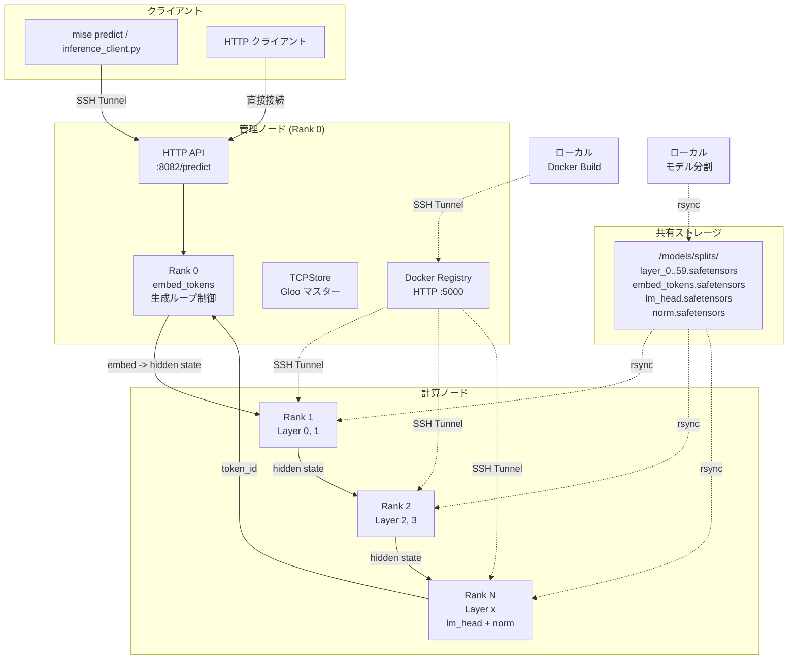
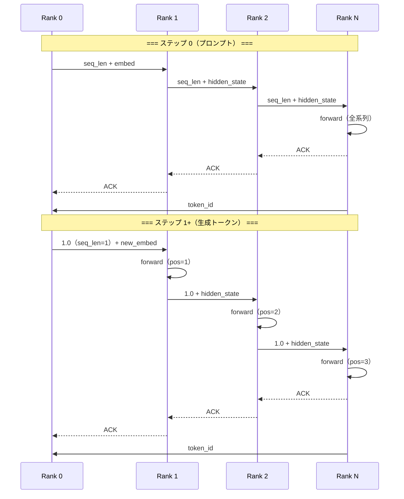
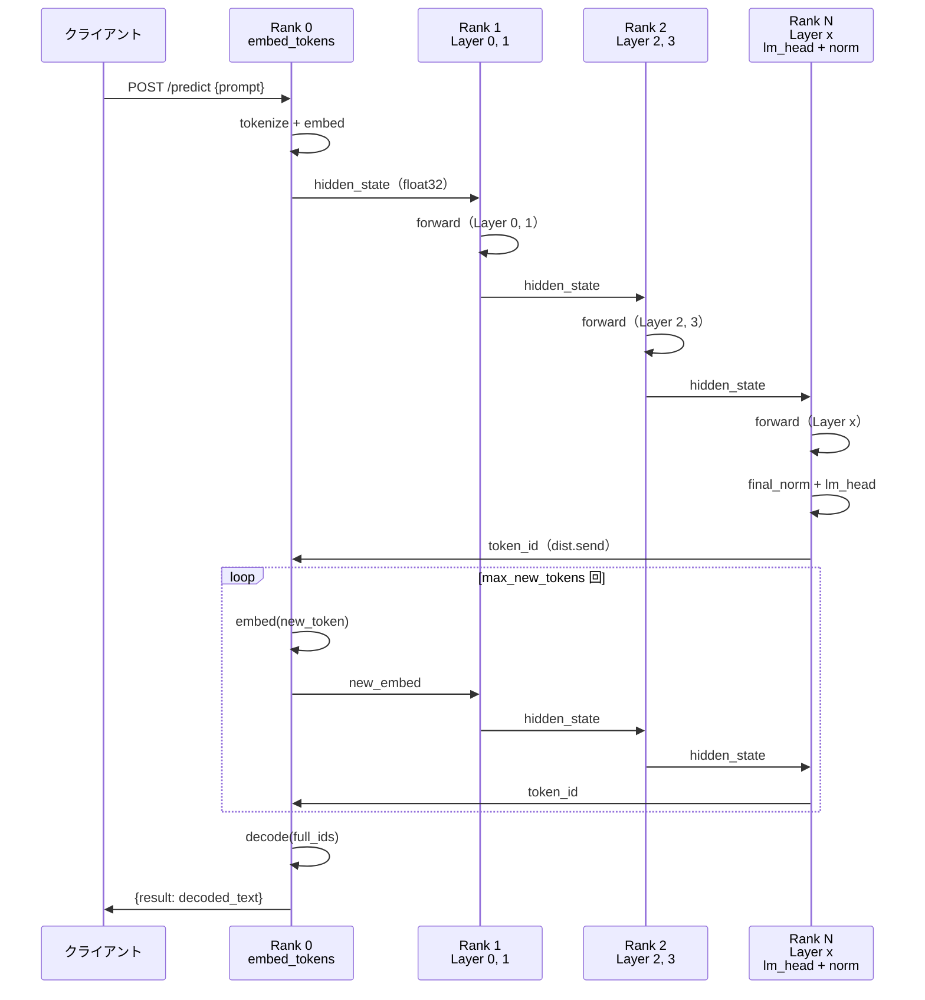
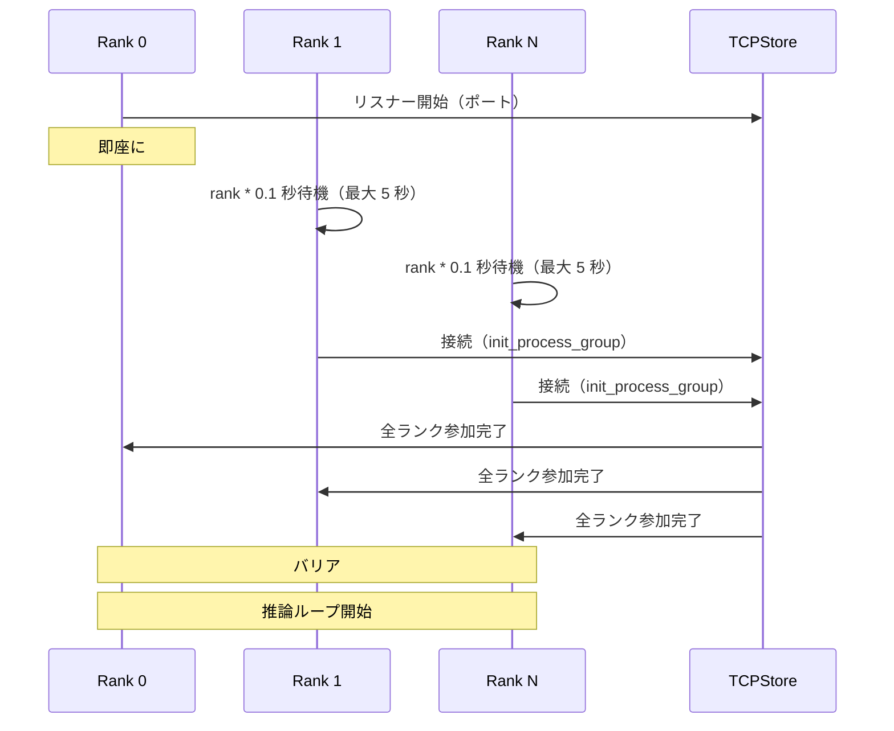

# 分散 CPU パイプライン並列 LLM 推論システム

`distributed-llm` は，単一 CPU のメモリや計算能力では収まらない大規模言語モデル（Gemma-4 31B-it など）を，ネットワークで接続された数十台の CPU マシンに分散して推論するシステムである．PyTorch の Gloo backend をパイプライン並列に用い，Transformer の各層をノード間に分割し，ストリーミングによって自己回帰的な生成を実現する．

このシステムは以下の 4 層から構成される．

1. **パイプライン推論エンジン** — 各ノードで動作する単一 Python スクリプト（`pipeline_inference.py`）
2. **モデル分割・配布ツール** — Hugging Face からのモデル取得とノード間配布を自動化するスクリプト群
3. **デプロイオーケストレーション** — Docker イメージのビルド，レジストリ経由の配布，コンテナ起動を管理するスクリプト
4. **運用・監視ツール** — ヘルスチェック，ログ表示，デバッグ，クラスター制御のユーティリティ

## 目次

- [システム構成](#システム構成)
- [技術スタック](#技術スタック)
- [パイプライン並列の原理](#パイプライン並列の原理)
- [推論プロトコル](#推論プロトコル)
- [最適化技術](#最適化技術)
- [ディレクトリ構成](#ディレクトリ構成)
- [セットアップ](#セットアップ)
- [デプロイ](#デプロイ)
- [推論の実行](#推論の実行)
- [運用・監視](#運用監視)
- [設定ファイル](#設定ファイル)
- [技術的詳細](#技術的詳細)
- [運用上の制約](#運用上の制約)

---

## システム構成

このシステムは「管理ノード（マスター）」と「計算ノード（ワーカー）」からなるクラスター上で動作する．管理ノードは Docker プライベートレジストリの構築，SSH 経由のデプロイコマンド配布，ヘルスチェックの集約を担う．計算ノードはモデルの層を保持し，パイプライン通信によって推論を実行する．

各ノードは `docker run` で起動されたコンテナ内で `pipeline_inference.py` を実行する．コンテナは `--net=host` モードで接続され，Gloo backend の TCP ソケット通信によって隠れ状態（hidden state）を送受信する．モデル重みはホストの `/models` にマウントされ，全ノードから読み込み専用で共有される．



## 技術スタック

| 層           | 技術                        | 役割                                   |
| ------------ | --------------------------- | -------------------------------------- |
| ランタイム   | Python 3.12 + PyTorch (CPU) | テンソル演算                           |
| 分散通信     | PyTorch Gloo (TCP)          | プロセス間通信，プロセスグループ管理   |
| モデル形式   | safetensors                 | メモリマップ対応の高速重み読み込み形式 |
| コンテナ     | Docker (host network)       | ノードレベルの環境分離                 |
| ファイル配布 | SSH + rsync                 | モデル重みと設定ファイルの配布         |
| レジストリ   | Docker Registry v2 (HTTP)   | プライベート Docker イメージ格納       |
| タスク管理   | mise.toml                   | ビルド・デプロイ・運用コマンドの定義   |

## パイプライン並列の原理

### パイプライン並列とは

モデル並列の一分野であり，ディープラーニングモデルの層を複数のデバイス（ここでは CPU ノード）に分割し，データをパイプラインとして流すことで並列計算を行う．順伝播では，各ノードが入力データを受け取り，自身の層を計算して出力を次のノードに渡す．逆伝播では勾配が逆順に流れる．

本システムは自己回帰生成が目的であるため，1 ステップごとに 1 トークンを生成し，毎回すべての層を順に通過させる．各パイプラインノードは「計算 → 通信 → 計算 → 通信」のサイクルを繰り返すことになる．

### 計算量と通信量の分析

Gemma-4 31B-it の単一デコーダ層について，隠れ次元 $d_{\text{model}} = 5376$，注意ヘッド数 $h = 32$，KV ヘッド数 $h_{\text{kv}} = 16$，系列長 $n$ とすると，計算量は概ね以下のようになる．

- **自己注意（self-attention）**: $O(n \cdot d_{\text{model}}^2 / h \cdot h_{\text{kv}})$
- **MLP（GELU）**: $O(4 \cdot n \cdot d_{\text{model}}^2 / \text{ffn\_mult})$
- **RMSNorm**: $O(n \cdot d_{\text{model}})$

通信量について，隠れ状態の形状は $(b, n, d_{\text{model}})$，dtype は `float32`（4 バイト）である．各送受信は $4 \cdot b \cdot n \cdot d_{\text{model}}$ バイトとなる．$b=1$，$n=1$（生成ステップ時），$d_{\text{model}}=5376$ とすると，ノード間リンクあたり約 21 KB である．この量は非常に小さいため，ネットワーク帯域よりも TCP ハンドシェイクやシステムコールのオーバーヘッドが支配的になる．

### パイプラインバブル

パイプライン並列における主な非効率性は「パイプラインバブル」（ノードがアイドル状態になる時間）である．バッチサイズ $B$，パイプラインステージ数 $D$ とすると，初期ウォームアップと最終アイドルを含むバブルステップ数は $2(D-1)$ となる．$M$ 個のマイクロバッチに分割した場合，バブル率は以下の式で表される．

$$
\text{バブル率} = \frac{D - 1}{M + D - 1}
$$

$M=4$，$D=51$（51 ノード）の場合，バブル率は約 92.4% となる．これはバッチレベルの推計であり，マイクロバッチが隙間なく流れる場合の実効バブルはより小さい．リレーモード（オンデマンド生成）ではバッチ処理を行わないため，この式は参考値としてのみ機能する．

### 非対称層割当の動機

単純な等分割当（各ノード $L/W$ 層）は，パイプラインの後端（最終ランクに近いノード）に計算負荷が集中しやすい．これは最終ランクが追加で `lm_head` と `final_norm` の計算，トークン ID の生成（argmax），隠れ状態の逆チェーンでの返却を行うためである．

本システムは各ノードが最低 1 層を持つことを保証した上で，剩余の層を順次先頭のノードに割当てる．これにより，后端の増加分を先頭ノードの追加層で相殺し，負荷の偏りを緩和する．

## 推論プロトコル

推論は 2 つのモードで動作する．

### リレーモード（オンデマンド生成）

1. クライアントが HTTP POST によってプロンプトを Rank 0 に送信
2. Rank 0 が全ノードにシグナルをブロードキャスト（ソケットベース）
3. 各ノードが `_relay_request` を実行:
   - **順チェーン**: Rank 0 -> Rank 1 -> ... -> Rank N
     - Rank 0: embed を Rank 1 に送信（`dist.send`）
     - 中間ランク: 受信 -> 計算 -> 次のノードに転送（`dist.send`）
     - 最終ランク: 受信 -> 計算 -> `final_norm` + `lm_head` でトークン ID 生成 -> Rank 0 に返却（`dist.send`）
   - **同期**: ACK チェーン（TCP ソケット）によってステップ間の順序を保証
4. 生成トークンが停止トークン（1 または 2）に達するか，同一トークンが 5 回連続で繰り返されるまでステップ 3 を繰り返す

各ステップは ACK チェーンで同期される．各ランクは次のノードにデータを送信した後，そのノードからの ACK を待つ．これにより通信の完了が保証され，データレースが防止される．



### パイプラインループモード（バックグラウンド）

リレーモード実行中，パイプラインスレッドは空のマイクロバッチループをサイクルし，`_relay_active` フラグによって通信バッファとの競合を回避する．リレーモード終了後，パイプラインループは再開される．

### 階層間通信の詳細

リレーモードにおける各ランクの役割を以下に示す．



- **Rank 0**: プロンプトをトークン化し，埋め込みを生成．`embed_tokens` 重みを保持．HTTP POST `/predict` を受信．
- **中間ランク**: 前のノードから隠れ状態を受信し，割り当てられた層で順伝播を計算して次のノードに転送．
- **最終ランク**: 全層の順伝播後，`final_norm` + `lm_head` によって論理値（logits）を計算し，argmax でトークン ID を取得．マスターに返却．

## 最適化技術

### ゼロアロケーション通信

推論ループ中には `torch.zeros()` や `tensor.clone()` などのメモリ確保を一切行わない．通信には事前に確保した `recv_buffers` と `send_buffers` へのインプレイス受信とコピーのみを使用する．これにより，GC 停止によるレイテンシ変動やメモリ断片化を排除する．

各バッファの形状は `(batch_size, seq_len, hidden_size)`，型は `float32` である．マイクロバッチ数（デフォルト 4）分のバッファが事前に確保される．

### マイクロバッチ分割

1 バッチを `num_micro_batches` 個に分割してパイプラインに供給する．これによりパイプラインバブル（ノードがアイドル状態になる時間）を最小化する．

### 順次起動プロトコル

全ノードが同時に Gloo プロセスグループの初期化を開始すると，サンダーリングヘルド問題によって接続タイムアウトが発生する可能性がある．これを回避するため，Rank 0 は即座にリスナーを開始し，他のランクは接続前に `rank * 0.1` 秒（最大 5 秒）の待機を挿入する．

モデル読み込みの staggering も，ノード間の読み込み完了時間の偏りを軽減する．


### 物理 NIC 固定バインディング

Gloo backend が使用するネットワークインターフェースを `GLOO_SOCKET_IFNAME` 環境変数で明示的に指定する．デフォルトルートの物理 NIC を `ip route` によって動的に検出し，設定する．これにより，仮想インターフェースやループバックへの誤接続を防止する．

### Intel OpenMP 置換

GNU OpenMP の代わりに Intel OpenMP ランタイムを `LD_PRELOAD` により読み込む．これにより `KMP_AFFINITY`（`granularity=fine,compact,1,0`）による細粒度のスレッドアフィニティ制御と，CPU コア間でのキャッシュ共有の最適化を有効にする．

### KV キャッシュ

自己回帰生成において，すでに処理済みのトークンのキー・バリュー表現を再利用するために，各 Transformer 層に KV キャッシュを実装する．Gemma-4 のスライダーウィンドウ注意に対応し，ウィンドウ外のキャッシュを自動的に破棄する．

各層は独立した書き込み位置カウンター（`_kv_cache_write_pos_ref`）を持ち，全ランクが正しい位置に書き込むことを保証する．

## ディレクトリ構成

```
.
├── pipeline_inference.py   # パイプライン推論ノードのメインエンジン（単一ファイル）
├── pyproject.toml          # Python プロジェクト定義（uv + hatch）
├── mise.toml               # タスク定義（build, deploy, 運用コマンド）
├── Dockerfile              # コンテナイメージ定義
├── config.json             # 環境固有の設定（モデル，クラスター，SSH など）
├── config.json.example     # 設定テンプレート
├── hosts.txt               # クラスターノード一覧（各行がランクに対応）
├── models/                 # 分割済みモデル重み（gitignore 対象）
│   └── splits/
│       ├── layer_0.safetensors ~ layer_59.safetensors
│       ├── embed_tokens.safetensors
│       ├── lm_head.safetensors
│       ├── norm.safetensors
│       └── split_info.json  # 層ごとのファイル情報とパラメータ数
└── tools/
    ├── common.py            # 全ツール共通のユーティリティ（SSH, rsync, 設定読み込み）
    ├── deploy.py            # 自動デプロイスクリプト（ビルド, 分割, 配布, 起動）
    ├── split_model.py       # Hugging Face モデルの層分割ツール
    ├── setup_registry.py    # Docker プライベートレジストリの構築
    ├── cluster_control.py   # コンテナの停止・再起動・クリーンアップ
    ├── healthcheck.py       # 全ノードのヘルスチェック
    ├── show_logs.py         # コンテナログの一括表示
    ├── debug_tools.py       # SSH, MTU, ポート, 温度などのデバッグ
    ├── predict.py           # 推論リクエスト送信クライアント
    └── inference_client.py  # SSH Tunnel 経由の推論クライアント
```

## セットアップ

### 前提条件

- Python 3.12 以降
- `uv`（Python パッケージマネージャ）
- `mise`（タスクランナー）
- Docker（ローカルビルド用）
- SSH 鍵認証が設定された管理ノードへのアクセス

### 初期セットアップ

```bash
# 1. 依存関係をインストール
mise run sync

# 2. 設定ファイルを作成
cp config.json.example config.json
# config.json を環境に合わせて編集
```

`config.json` の主要項目:

- `model.name`: Hugging Face のモデル名（例: `google/gemma-4-31B-it`）
- `model.overrides`: モデル仕上の上書き（`num_hidden_layers`, `hidden_size` など）
- `cluster.master_addr`: マスターノードのホスト名
- `cluster.master_port`: PyTorch Gloo マスターポート
- `cluster.hosts_file`: ノード一覧ファイル
- `ssh.user`: SSH 接続ユーザー名
- `docker.image_name`: Docker イメージ名
- `deploy.work_dir`: 遠隔ノード上の作業ディレクトリ

### hosts.txt の設定

`hosts.txt` の各行はランク番号に対応する．1 行目が Rank 0（マスター），2 行目が Rank 1，となる．

```
wafl-ctrl1    # Rank 0（マスター）
wafl100       # Rank 1
wafl101       # Rank 2
...
wafl139       # Rank 40
wafl200       # Rank 41
...
wafl209       # Rank 50
```

## デプロイ

### Docker レジストリのセットアップ

管理ノード上で Docker プライベートレジストリを起動する．

```bash
mise run setup:registry
```

マスターノードのポート 5000 上に Docker Registry v2 を起動する（HTTP，TLS なし）．データは `/var/lib/registry` に永続化される．既存の `secure-registry` コンテナが存在する場合は停止・削除された上で再起動される．

### モデルの分割とダウンロード

Hugging Face からモデルをダウンロードし，層ごとに分割する．

```bash
# 分割計画の表示のみ
mise run split:models:dry-run

# 実際の実行（マスターへの転送を含む）
mise run split:models
```

`split_model.py` は以下の処理を行う:

1. `huggingface_hub.snapshot_download` でモデルをローカルキャッシュにダウンロード（既存の場合はスキップ）
2. `AutoModelForCausalLM` で CPU にロード
3. `state_dict()` から層ごとの重みを抽出
4. `safetensors` 形式で `layer_N.safetensors` として出力
5. `embed_tokens.safetensors`, `lm_head.safetensors`, `norm.safetensors` も個別に出力
6. 層ごとのファイル名，パラメータ数，キー一覧を `split_info.json` に記録

モデルロード時に `num_hidden_layers` の取得が失敗した場合，`config.json` の `model.overrides` で明示的に指定できる．検索は以下の順序で行われる:

1. `num_hidden_layers`, `num_layers`, `n_layers` などのトップレベル属性
2. `config.__dict__` 内に "layer" と "hidden" を含むキー
3. `text_config` などのネストされた設定内の再帰的検索

### ワンコマンドデプロイ

全フェーズ（ビルド，モデル分割，配布，コンテナ起動）を一度に実行する．

```bash
# ドライラン（実行なし）
mise run deploy:dry-run

# 実際の実行
mise run deploy
```

各フェーズの詳細:

| フェーズ    | コマンド                  | 説明                                                                                  |
| ----------- | ------------------------- | ------------------------------------------------------------------------------------- |
| 1. ビルド   | `deploy.py --build-only`  | ローカルで Docker イメージをビルドし，SSH Tunnel 経由でマスターのレジストリにプッシュ |
| 2. 分割     | `deploy.py --split-only`  | モデルを分割して rsync でマスターに転送                                               |
| 3. 配布     | `deploy.py --deploy-only` | マスターから各ノードへモデル重みを rsync で配布（最大 10 並列）                       |
| 4. デプロイ | `deploy.py`               | 各ノードでイメージをプルしコンテナを起動（混雑回避のため staggered）                  |


### デプロイの各フェーズの詳細

**フェーズ 1: Docker イメージのビルドとプッシュ**

1. ローカルで `docker build -t {image_name} .` を実行
2. SSH Tunnel を介してレジストリへの接続を確立（ControlMaster オプションを無効化）
3. `docker push localhost:{registry_port}/{image_name}` でプッシュ
4. Tunnel 終了後，イメージタグを確認

SSH Tunnel の確立には最大 15 秒を割り当て，30 回のポーリング（0.5 秒間隔）によってポートのオープンを検出する．Tunnel が失敗した場合，SSH の stderr をログに出力して終了する．

**フェーズ 2: モデルの分割と転送**

1. `split_model.py` をローカルで実行（`uv run` 経由）
2. 結果をマスターの `work_dir/models/splits/` へ rsync で転送
3. 既存のファイルはチェックサム検証によって.corrupt 検出

**フェーズ 3: モデル重みの配布**

1. マスターから各ノードへ必要な層のみを rsync で転送
2. 各ノードは非対称割当に基づいて必要なファイルのみを受け取る
3. 最大 10 並列で実行

転送前に必要なファイルの存在をチェックし，すべて存在する場合は転送をスキップする．rsync の `--checksum` オプションによってファイルの corrupt 検出を行う．

**フェーズ 4: コンテナの起動**

1. 各ノードの `/etc/hosts` にマスター IP を追加
2. 既存のコンテナを停止・削除
3. Docker daemon の `insecure-registries` を設定（Rank 0 以外）
4. イメージをプルし，コンテナを起動

コンテナ起動時には以下の設定が行われる:

- `--cpuset-cpus`: CPU アフィニティ（`config.json` または環境変数で指定）
- `-v {model_mount_path}:/models:ro`: モデル重みの読み込み専用マウント
- `-v /var/cache/torch_compile:/torch_compile_cache:rw`: torch.compile のキャッシュ永続化
- `--net=host`: ホストネットワーク直接使用
- `--restart=unless-stopped`: 自動再起動ポリシー

### コンテナの環境変数

各ノードのコンテナに設定される環境変数:

| 変数名                    | 値                           | 説明                                    |
| ------------------------- | ---------------------------- | --------------------------------------- |
| `MASTER_ADDR`             | マスターノード名             | Gloo マスターアドレス                   |
| `MASTER_PORT`             | ポート番号                   | Gloo マスターポート（デフォルト 29500） |
| `RANK`                    | 0 ~ N                        | このノードの識別子                      |
| `WORLD_SIZE`              | ノード数                     | クラスター全体のノード数                |
| `NODE_IPS`                | 全ノードの IP 一覧           | リレーモードでのノード間シグナル送信    |
| `GLOO_SOCKET_IFNAME`      | 検出された NIC               | Gloo 通信インターフェース               |
| `TP_SOCKET_IFNAME`        | 検出された NIC               | Tensor Parallel 用インターフェース      |
| `GLOO_SOCKET_TIMEOUT_MS`  | 3600000                      | Gloo 通信タイムアウト（ms，60 分）      |
| `OMP_NUM_THREADS`         | 4                            | OpenMP スレッド数                       |
| `OMP_PROC_BIND`           | CLOSE                        | OpenMP スレッドバインディング           |
| `KMP_AFFINITY`            | granularity=fine,compact,1,0 | Intel OpenMP スレッドアフィニティ       |
| `KMP_BLOCKTIME`           | 1                            | OpenMP スレッドブロック時間（秒）       |
| `NUM_MICRO_BATCHES`       | 4                            | マイクロバッチ数                        |
| `STAGGER_INTERVAL`        | 3.0                          | マイクロボッチ間のインターバル（秒）    |
| `MODEL_PATH`              | /models                      | モデル重みのパス                        |
| `HF_HOME`                 | /app/.cache/huggingface      | Hugging Face キャッシュディレクトリ     |
| `TORCHINDUCTOR_CACHE_DIR` | /torch_compile_cache         | torch.compile コンパイルキャッシュ      |
| `LANG` / `LC_ALL`         | C.UTF-8                      | UTF-8 ロケール                          |

## 推論の実行

### HTTP API 経由

マスターノードのポート 8082 で HTTP サーバーが動作する．POST `/predict` でプロンプトを送信し，JSON 形式で結果を受信する．

```bash
# mise コマンドで送信
mise run predict

# デモプロンプト
mise run predict:demo
```

### クライアントスクリプト経由

SSH Tunnel を自動で確立し，推論リクエストを送信する．

```bash
uv run python tools/inference_client.py "Hello, world"
```

`inference_client.py` は以下の処理を行う:

1. 引数または stdin からプロンプトを取得
2. `ssh -L {port}:127.0.0.1:{port}` で SSH Tunnel を確立
3. Tunnel 確立後（最大 15 秒，30 回のポーリング），`http://127.0.0.1:{port}/predict` に POST
4. 結果を出力し，Tunnel を終了

### レスポンス形式

成功時:

```json
{"result": "生成されたテキスト"}
```

エラー時:

```json
{"error": "process group not ready"}           // 503: 初期化前
{"error": "barrier not completed"}             // 503: バリア未完了
{"error": "only rank 0 handles requests"}      // 500: Rank 0 以外
{"error": "relay failed"}                      // 500: 推論失敗
{"error": "invalid json"}                      // 400: リクエスト形式不正
{"error": "empty prompt"}                      // 400: 空のプロンプト
{"error": "not found"}                         // 404: 無効なパス
{"error": "relay timeout"}                     // 504: タイムアウト（最大 1200 秒）
```

### 生成の停止条件

生成は以下の条件のいずれかが満たされた時点で停止する:

1. **EOS トークン検出**: トークン ID が 1 または 2 に達した
2. **トークンループ検出**: 同一トークンが 5 回連続で生成された
3. **パターンループ検出**: 直近 6 トークンのパターンが過去に出現した（最大 100 トークン生成）

## 運用・監視

### ヘルスチェック

全ノードにおいて SSH 接続性，Docker ステータス，コンテナ状態，モデル重み，MTU を検証する．

```bash
# 基本チェック
mise run status

# 詳細チェック（CPU 温度，ログを含む）
mise run status:verbose
```

チェック項目:

1. **SSH 接続性** — 管理ノード経由で全ノードに `true` コマンドを送信
2. **Docker デーモン** — `docker info` の実行結果を確認
3. **コンテナ状態** — `docker inspect -f '{{.State.Status}}' distributed-llm`
4. **モデル重み** — Rank 0 は `embed_tokens.safetensors` と `lm_head.safetensors` のみをチェック．Rank 1+ は `layer_*.safetensors` もチェック
5. **MTU 設定** — デフォルトルートに対応する NIC の MTU を取得（1500 または 9000 を推奨）
6. **CPU 温度**（verbose のみ） — `/sys/class/thermal/thermal_zone0/temp` を読み取り，85°C 以上で警告

### ログ表示

```bash
# 全ノードの最新ログを一括表示
mise run logs

# 特定ノードのログをフォロー（Ctrl+C で終了）
RANK=0 uv run python tools/show_logs.py
```

`show_logs.py --all` は各ノードの `docker logs --tail 32` を実行し，Rank 番号と IP アドレス付きで表示する．単一ノードのフォロー表示は，管理ノード経由で 2 段階 SSH 接続し，`docker logs --tail 100 -f distributed-llm` を実行する．

### クラスター制御

```bash
# 全ノードのコンテナを停止
uv run python tools/cluster_control.py stop

# 全ノードのコンテナを再起動
uv run python tools/cluster_control.py restart

# 全ノードからコンテナとイメージを完全削除
uv run python tools/cluster_control.py clean [--force]
```

`clean` コマンドはデフォルトで確認プロンプトを表示する（`--force` でスキップ）．停止 → 削除 → イメージ削除を全ノードで並列実行する．

### デバッグ

```bash
# SSH 接続テスト
mise run debug:ssh

# MTU 設定の確認
mise run debug:mtu

# モデル重みの配置確認
mise run debug:models

# ポートのオープン状態確認
mise run debug:ports

# CPU 温度の確認
mise run debug:temp
```

`debug_tools.py ports` では，管理ノード上で以下のポートをチェックする:

| ポート | 用途              |
| ------ | ----------------- |
| 29500  | PyTorch マスター  |
| 5000   | Docker レジストリ |
| 8081   | シグナルソケット  |
| 8082   | HTTP predict      |
| 8083   | リレー ACK        |

## 設定ファイル

### config.json

```json
{
  "model": {
    "name": "google/gemma-4-31B-it",
    "format": "safetensors",
    "overrides": {
      "num_hidden_layers": 60,
      "hidden_size": 5376,
      "num_attention_heads": 32,
      "num_key_value_heads": 16
    }
  },
  "cluster": {
    "master_addr": "wafl-ctrl1",
    "master_port": 29500,
    "hosts_file": "hosts.txt"
  },
  "ssh": {
    "user": "denjo"
  },
  "docker": {
    "image_name": "distributed-llm:latest",
    "registry_port": "5000"
  },
  "deploy": {
    "work_dir": "~/workspace/ktakahashi/distributed-llm"
  }
}
```

各セクションの詳細:

- **model**: モデル仕様．`name` は Hugging Face のリポジトリ名．`format` は重みファイルの形式（`safetensors` または `pt`）．`overrides` で `num_hidden_layers` などを上書きできる．
- **cluster**: クラスター設定．`master_addr` は TCPStore のオーナーノード．`master_port` は Gloo 初期化ポート．
- **ssh**: SSH 接続情報．
- **docker**: Docker イメージ名とレジストリポート．
- **deploy**: 遠隔ノード上の作業ディレクトリ．モデル重みがマウントされる場所．

### 環境変数による上書き

`config.json` の設定は以下の環境変数で上書きできる．環境変数が優先される．

| 環境変数             | 対応する設定                        |
| -------------------- | ----------------------------------- |
| `MASTER_ADDR`        | `cluster.master_addr`               |
| `MASTER_PORT`        | `cluster.master_port`               |
| `RANK`               | このノードのランク                  |
| `WORLD_SIZE`         | ノード数                            |
| `GLOO_SOCKET_IFNAME` | 通信インターフェース                |
| `MODEL_NAME`         | `model.name`                        |
| `TOTAL_LAYERS`       | `model.overrides.num_hidden_layers` |
| `WEIGHT_FORMAT`      | `model.format`                      |
| `NUM_MICRO_BATCHES`  | マイクロバッチ数                    |
| `BATCH_SIZE`         | バッチサイズ                        |
| `SEQ_LEN`            | 系列長                              |
| `MODEL_PATH`         | モデル重みパス                      |
| `IMAGE_NAME`         | Docker イメージ名                   |
| `WORK_DIR`           | 作業ディレクトリ                    |
| `STAGGER_INTERVAL`   | マイクロバッチ間インターバル        |
| `CPUSET_CPUS`        | CPU アフィニティ                    |
| `OMP_NUM_THREADS`    | OpenMP スレッド数                   |
| `LOG_LEVEL`          | ログレベル（INFO または TRACE）     |

### ログ出力フォーマット

システム内の全ログは統一フォーマットで出力される．

```
[LEVEL] メッセージ
```

サポートされるレベル:

| レベル    | 説明                                   |
| --------- | -------------------------------------- |
| `INFO`    | 標準的な情報メッセージ                 |
| `DEBUG`   | デバッグ情報（通常非表示）             |
| `OK`      | 処理の成功                             |
| `FAIL`    | 処理の失敗                             |
| `WARN`    | 警告（継続可能な問題）                 |
| `ERROR`   | エラー（処理の停止を意味する場合あり） |
| `STEP`    | フェーズの区切り                       |
| `RESULT`  | 最終結果                               |
| `DRY-RUN` | ドライラン時の計画表示                 |
| `TRACE`   | 詳細トレース（`LOG_LEVEL=TRACE` のみ） |

`pipeline_inference.py`（推論エンジン）では，ランク情報付きのフォーマットが使用される:

```
[R{rank} LEVEL] メッセージ
```

TRACE レベルは `LOG_LEVEL=TRACE` 環境変数が設定された場合にのみ有効になる．無効化されている場合，PyTorch の `torch.compile` はこれをガード変数として認識し，TRACE ブロックをデッドコードとして除外することでグラフの分岐を防止する．

## 技術的詳細

### Transformer 層の実装

`pipeline_inference.py` の `_build_transformer_layer` メソッドは，最小限の Gemma-4 デコーダ層を実装する．各層の順伝播は以下の順序で実行される:

1. **Pre-attention RMSNorm** — `input_layernorm.weight`
2. **自己注意（線形射影）** — `q_proj`, `k_proj`, `v_proj`
3. **注意用の形状変換** — 多ヘッド形式に変換
4. **Q/K Norm** — `q_norm.weight`, `k_norm.weight`
5. **RoPE（回転位置埋め込み）** — `rope_parameters` に基づいて位置埋め込みを適用
6. **KV キャッシュへの追加** — スライダーウィンドウ対応
7. **GQA（グループ化クエリー注意）** — KV ヘッドを Q ヘッド数に展開
8. **注意スコア + 因果マスク** — スコアを計算し，因果マスクを適用
9. **出力射影** — `o_proj.weight`
10. **Post-attention RMSNorm + 残差結合** — `post_attention_layernorm.weight`
11. **Pre-FFN RMSNorm** — `pre_feedforward_layernorm.weight`
12. **MLP（GELU）** — `gate_proj`, `up_proj`, `down_proj`
13. **Post-FFN RMSNorm + 残差結合** — `post_feedforward_layernorm.weight`
14. **層スカラー** — `layer_scalar`（Gemma-4 の per-layer input scale）

```mermaid
graph LR
    A[hidden_state<br/>float32] --> B[Pre-attn<br/>RMSNorm]
    B --> C[Q/K/V 射影]
    C --> D[形状変換 +<br/>Q/K Norm]
    D --> E[RoPE]
    E --> F[KV キャッシュ<br/>追加]
    F --> G[GQA<br/>展開]
    G --> H[注意<br/>スコア + マスク]
    H --> I[出力射影]
    I --> J[Post-attn<br/>RMSNorm + 残差]
    J --> K[Pre-FFN<br/>RMSNorm]
    K --> L[MLP<br/>GELU]
    L --> M[Post-FFN<br/>RMSNorm + 残差]
    M --> N[層スカラー]
    N --> O[出力<br/>hidden_state]
```



### RoPE（回転位置埋め込み）

Gemma-4 は `partial_rotary_factor`（デフォルト 0.25）を使用する．これは次元の 25% のみが回転し，残りは通過する．`rope_type` が `proportional` の場合，スケーリング係数によって系列長の拡張を処理する．

回転位置埋め込みは，位置情報を直接入力ベクトルに組み込む位置埋め込み方法である．各次元対 $(2i, 2i+1)$ について，位置 $m$ で回転行列を適用する．

$$
x_m = R_\theta(m) \cdot x
$$

ここで $R_\theta(m)$ は周波数ベクトル $\theta$ に基づく回転行列であり，相対位置情報 $m-k$ をモデルに明示的に伝える．

### Gemma-4 固有の処理

- **q_norm / k_norm**: 注意計算前に Q と K を正規化（Gemma-4 の標準的な処理）
- **final_logit_softcapping**: `lm_head` の出力に `tanh(x / softcap) * softcap` を適用（デフォルト 30.0）
- **layer_types**: 層ごとに `sliding_attention` または `full_attention` を指定．スライダーウィンドウ注意はウィンドウサイズ 1024 で因果マスクを適用
- **スライダーウィンドウ注意**: 注意計算の対象を直近 1024 トークンに制限．KV キャッシュもウィンドウ内にのみ保持

### 分散通信の詳細

#### プロセスグループの初期化

Gloo backend を `dist.init_process_group()` によって初期化する．`init_method` を `tcp://{MASTER_ADDR}:{MASTER_PORT}` として指定し，TCPStore ベースのレンデブーを使用する．タイムアウトはデフォルト 600 秒（`GLOO_SOCKET_TIMEOUT_MS`）．

最大 5 回のリトライ機構が実装されている．「2 度目の初期化」エラーが発生した場合，プロセスグループを破棄して再初期化する．



#### 隠れ状態の通信

通信バッファは `float32` 型，形状は `(batch_size, seq_len, hidden_size)` である．Rank 0 以外のランクは前のノードから `dist.recv()` で受信し，割り当てられた層で順伝播を計算した後，`dist.send()` で次のノードに送信する．

リレーモードでは，初期ステップで系列長が別チャンネルで送信され，以降のステップでは系列長 1 が送信される．最終ランクは非同期受信（`dist.irecv()`）によって系列長と隠れ状態の受信を並列化する．

#### ACK チェーンによる同期

リレーモードでは，各ステップの完了を ACK チェーンによって確認する．最終ランクは前のノードと Rank 0 の両方に ACK を送信する．中間ランクは次のノードからの ACK を受け取り，前のノードに ACK を返す．これにより，データが正しく受信されたことが保証される．

 persistent な ACK ソケット接続が各ステップの前に確立され，per-step の TCP ハンドシェイクを排除する．接続の確立時にはサンダーリングヘルドを回避するため，ランクごとに `rank * 0.1` 秒（最大 5 秒）の待機が挿入される．

### Docker イメージ

`Dockerfile` は `python:3.12-slim` をベースイメージとし，以下のコンポーネントをインストールする:

- **OpenBLAS**: 高性能行列演算ライブラリ
- **numactl**: NUMA メモリアフィニティ制御
- **iproute2**: 物理 NIC の動的検出（`ip route` コマンド）
- **procps**: プロセス監視ツール
- **Intel OpenMP**: GNU OpenMP の置換
- **PyTorch (CPU)**: CPU 専用ホイール
- **transformers, safetensors, huggingface_hub**: モデル読み込み
- **tqdm**: 進捗表示

ビルド時に Hugging Face のモデル設定をプリキャッシュすることで，起動時のネットワークハングを防止する．コンテナは `llmuser` という非 root ユーザーで実行される．

### torch.compile のキャッシュ

`TORCHINDUCTOR_CACHE_DIR=/torch_compile_cache` を設定し，コンパイル済みカーネルを `/models` 下のボリュームに永続化する．デフォルトの `/tmp/torchinductor_<user>/` はコンテナ再起動時に削除されるため，モデル重みと同じボリュームに配置することで再起動後の再コンパイルを回避する．

## 運用上の制約

- **WORLD_SIZE <= num_hidden_layers**: ノード数は層数を超えられない
- **ノードあたり最大 2 層**: WORLD_SIZE が小さすぎると，1 ノードが 3 層以上持つことになり，この制限に違反する
- **マスターノード（Rank 0）は層を持たない**: TCPStore のみを処理し，計算負荷は Rank 1+ に分散される
- **生成トークン数**: 最大 100 トークン（`max_new_tokens`）．同一トークンが 5 回連続で繰り返された場合は早期終了
- **KV キャッシュ容量**: 最大 2048 トークン（プロンプト + 生成の合計）
- **通信タイムアウト**: デフォルト 60 分（`GLOO_SOCKET_TIMEOUT_MS=3600000`）
- **初期化タイムアウト**: デフォルト 25 分（`INIT_TIMEOUT_MINUTES=25`）
- **Gemma-4 のスライダーウィンドウ**: ウィンドウサイズ 1024．系列長がこれを超えると，ウィンドウ外の KV は無視される
- **ネットワーク**: 全ノードが `--net=host` モードで接続されるため，ポートの競合に注意
- **SSH**: 全ツールは `BatchMode=yes` で実行される．SSH 鍵認証が事前に設定されている必要がある
